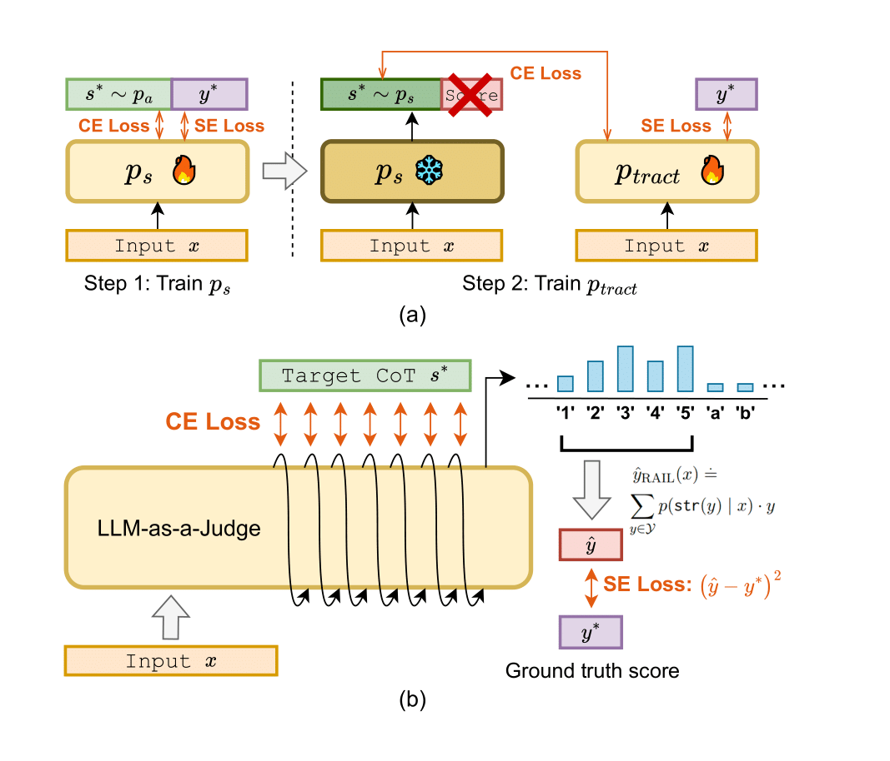

# TRACT: Regression-Aware Fine-tuning Meets Chain-of-Thought Reasoning for LLM-as-a-Judge

[](https://arxiv.org/abs/2503.04381)
[](https://huggingface.co/dcml0714/Llama-3.1-8B-Instruct-TRACT)

This repo contains the code for the paper [TRACT: Regression-Aware Fine-tuning Meets Chain-of-Thought Reasoning for LLM-as-a-Judge
](https://arxiv.org/list/cs.CL/recent).

<p align="center"></p>


## Quick Links
- [Models](#models)
- [License](#license)
- [Setup](#setup)
- [Fine-tuning](#fine-tuning)
- [Inference](#inference)
- [Citation](#citation)

## Models
We open-source our models on Huggingface. These models can be used for direct assessment tasks in LLM-as-a-Judge.
- [dcml0714/Llama-3.1-8B-Instruct-TRACT](https://huggingface.co/dcml0714/Llama-3.1-8B-Instruct-TRACT): This is the TRACT model fine-tuned based on Llama-3.1-8B-Instruct. This model is better than the model fine-tuned using Mistral.
- [dcml0714/Mistral-7b-v0.2-Instruct-TRACT](https://huggingface.co/dcml0714/Mistral-7b-v0.2-Instruct-TRACT/): This is the TRACT model fine-tuned based on Mistral-7b-Instruct-v0.2

## License
We release the model under the Apache 2.0 license.
Since our models are trained using Feedback Collection, a dataset generated from OpenAI GPT-4, the models are further subject to [OpenAI’s Terms of Use](https://openai.com/policies/row-terms-of-use/).
Additionally, the models fine-tuned from Llama-3.1-8B-Instruct is also further subject to the [Llama 3.1 Community License](https://github.com/meta-llama/llama-models/blob/main/models/llama3_1/LICENSE).

## Setup

First, clone this repo by 
```
git clone https://github.com/d223302/TRACT
```

We use Llama-Factory for training and use vLLM for inference. To avoid package conflicts, we use two separate environments for fine-tuning and inference. 

### Environment for Fine-tuning
Create a conda environment by
```
conda create -y -n tract python=3.11
conda activate tract
```

Next, install all the necessary packages. Since we will be using [LLaMA-Factory
](https://github.com/hiyouga/LLaMA-Factory/tree/main) for fine-tuning, please go to [LLaMA-Factory
](https://github.com/hiyouga/LLaMA-Factory/tree/main) and follow the [installation guides](https://github.com/hiyouga/LLaMA-Factory/tree/main?tab=readme-ov-file#getting-started).


Also, install `colorama` for printing colored words on the terminal by
```
pip install colorama
```

For full reproducibility, we share the full list of packages for the fine-tuning environment in `envs/train_requirements.txt`.
However, maybe some packages are not required.

### Environment for Inference

For infernece, we use [vLLM](https://github.com/vllm-project/vllm).
We create another conda environment for inference.
Start by
```
conda deactivate
conda create -y -n vllm python=3.11
conda activate vllm 
```
Next, follow the installation instruction of vLLM to install it, which is simply

```
pip install vllm
```

We also provide the list of packages in the environment we use for inference at `envs/inference_requirements.txt`.
Again, it is possible that not all packages are necessary.

## Fine-tuning

Training the TRACT models involves two steps: first training on the original Feedback-Collection dataset using CoT-RAFT, and then train again using self-generated CoTs. You can follow the steps below. 

### 1. Prepare Stage 1 Fine-tuning Dataset

We are using LLaMA-Factory for fine-tuning, and we will need to prepare the data to match the format for LLaMA-Factory.

We will use two datasets: [`prometheus-eval/Feedback-Collection`](https://huggingface.co/datasets/prometheus-eval/Feedback-Collection?row=0) for training and [`prometheus-eval/Feedback-Bench`](https://huggingface.co/datasets/prometheus-eval/Feedback-Bench) for evaluation.

Generate the dataset using the script `finetuning_utils/prepare_dataset.py`.

An example usage can be:

```
python3 prepare_dataset.py \
    --output_dir data \
    --dataset prometheus-eval/Feedback-Collection \
    --mode feedback_score \
    --prompt_dir prompts \
    --tokenizer mistralai/Mistral-7B-Instruct-v0.2 \
    --cot_no_result \
    --num_samples -1
```
Refer to the arguments to see how to use this script.

After running this script, you should see a `*.jsonl` in the output directory you just specified. Copy it to the data directory of Llama-Factory, which should located at `$llama-factory_root/data`.
You will also need to modify the `data_info.json` in `$llama-factory_root/data`. Refer to [here](https://github.com/hiyouga/LLaMA-Factory/tree/main/data) to see how to modify it. You can also find a .json snippet from the output when running `prepare_dataset.py`, which can be slightly modified to be copy-paste to the `data_info.json`

### 2. Customizing CoT-RAFT for Llama-Factory and Transformers

Since CoT-RAFT is not a standard fine-tuning objective supported by `transformers` and `llama-factory`, we will need to manually modify some codes in the two packages for our need.
 
#### Transformers

Please find where you install transformers and find the file `src/transformers/trainer_seq2seq.py`.
Add two lines of codes following [this PR](https://github.com/huggingface/transformers/pull/35136/files).
This is because the `Trainer` class supports the `compute_loss_func`, but this is not yet supported by Seq2SeqTrainer.

Note that in the latest transformers, the above PR has been merged. But I am not sure if the llama-factory supports the latest transformers. I only test the codes on `transformers==4.46.1` and Llama-factory specified version specified in `envs/train_requirements.txt`.

#### Llama-Factory

We customize some functions for CoT-RAFT to make it compatible with Llama-factory. All the relevant codes are in `finetuning_utils/cot_with_raft/`.


- **Step 1**: Copy the folder `finetuning_utils/cot_with_raft/` to `$llama-factory_root/src/llamafactory/train`.

    ```
    cp -r finetuning_utils/cot_with_raft/ $llama-factory_root/src/llamafactory/train
    ``` 

- **Step 2**: Modify the file `$llama-factory_root/src/llamafactory/train/tuner.py`:

    - Add `from .cot_with_raft import run_cot_raft`
    - Add the following block in run_exp:
        ```
        elif finetuning_args.stage == "cot_raft":
            run_cot_raft(model_args, data_args, training_args, finetuning_args, generating_args, callbacks)
        ```
- **Step 3**: Copy the file `finetuning_utils/cot_with_raft/custom_processor.py` to `$llama-factory_root/src/llamafactory/data/processors`
- **Step 4**: Modify the file `$llama-factory_root/src/llamafactory/data/preprocess.py`:
    - Add `from .processros.custom_processor import preprocess_cot_raft_dataset`
    - Add 
        ```
        elif stage == "cot_raft":
            preprocess_func = partial(
                preprocess_cot_raft_dataset,
                template=template,
                tokenizer=tokenizer,
                processor=processor,
                data_args=data_args,
            )
            print_function = partial(print_supervised_dataset_example, tokenizer=tokenizer)
        ```


> ⚠️ **Warning:** Currently, the CoT-RAFT is hard-coded for Mistral-7B-Instruct-v0.2. If you want to use other models, you must change the `score_to_indices` and `indices_to_scores` in `finetuning_utils/cot_with_raft/custom_loss.py`. It should be easy to see where to comment out.


### 3. Stage 1 TRACT Fine-tuning

We Fine-tune with Llama-Factory. You can follow the how fine-tuning is done in Llama-Factory. For example, you can copy the `finetuning_utils/config/cot_raft_mistral.yaml` to `$llama-factory_root/examples/train_lora` and run fine-tuning by 
```
cd $llama-factory_root
llamafactory-cli train examples/cot_raft_mistral.yaml
```

Please refer to the paper to fine the hyperparameters used for fine-tuning.

### 4. Generate Self-Generate CoTs for Stage-2 TRACT Training
After your model is trained, you can use it to generate the training data (self-generated CoTs) that will be used in stage 2 TRACT training.
If you are using LoRA fine-tuning, as we did in our paper, you will need to merge the LoRA with the LLM backbone first.

Next, use the inference script in  `inference/inference.py` to generate the training data.
Run by
```
python3 inference.py \
        --output_dir evaluation_result \
        --dataset prometheus-eval/Feedback-Collection \
        --mode feedback_score \
        --prompt_dir ../finetuning_utils/prompts/feedback_collection/with_feedback.prompt \
        --model_name_or_path YOUR_FINE_TUNED_MODEL \
        --tokenizer mistralai/Mistral-7B-Instruct-v0.2 \
        --num_samples -1 \
        --score_generation_mode decode \
        --tensor_parallel_size 1 \
        --n_cot 1 \
        --prepare_training_data \
        --output_training_data_name YOUR_NEW_DATASET_NAME
```

The resulting dataset should be the format for Llama-Factory, and you can directly use it for fine-tuning the second stage in TRACT.

### 5. Stage 2 TRACT Fine-tuning
Repeat the steps in [Step 2](#3-stage-1-tract-fine-tuning). You just need to change the dataset.

## Inference

The inference codes are in `inference/`.
All the datasets we use are placed in `inference/data`; they are copied from [Promethues-Eval](https://github.com/prometheus-eval/prometheus-eval/tree/main/eval/benchmark/data).
Please **do not** use the datasets on Huggingface datasets.

We use `inference/inference.py` for inference. Use `python3 inference.py -h` to see how to use the arguments.

Some important arguments:
- `--mode`: This determines whether to generate CoT then the score (`feedback_score`) or directly generate the score (`score_only`)
- `--score_generation_mode`: Whether to generate the score using standard LM decoding/sampling (`decode`) or using RAIL (`raft`)
- `--n_cot`: The number of CoTs generated for each input prompt. For multiple CoTs (`n_cot` >1), we average the scores obtained from each CoT


Run CoT-RAIL inference using
```
python3 inference.py \
    --output_dir $output_dir \
    --dataset $path_to_dataset \
    --mode feedback_score \
    --prompt_dir ../finetuning_utils/prompts \
    --model_name_or_path $model_name \
    --tokenizer mistralai/Mistral-7B-Instruct-v0.2 \
    --num_samples -1 \
    --score_generation_mode raft \
    --tensor_parallel_size 1 \
    --n_cot $n_cot \
    --seed $random_seed \
    --is_formattted \
    --save
```

Run inference of standard decoding with CoT using 
```
python3 inference.py \
    --output_dir $output_dir \
    --dataset $path_to_dataset \
    --mode feedback_score \
    --prompt_dir ../finetuning_utils/prompts \
    --model_name_or_path $model_name \
    --tokenizer mistralai/Mistral-7B-Instruct-v0.2 \
    --num_samples -1 \
    --score_generation_mode decode \
    --tensor_parallel_size 1 \
    --seed $random_seed \
    --n_cot $n_cot \
    --is_for
```

The codes for the RAIL predictor are defined by `raft_score_processor` located in `inference/inference_utils/generation_utils.py`


## Citation
If you find TRACT or our repo useful, please cite it by

```
@misc{chiang2025tractregressionawarefinetuningmeets,
      title={TRACT: Regression-Aware Fine-tuning Meets Chain-of-Thought Reasoning for LLM-as-a-Judge}, 
      author={Cheng-Han Chiang and Hung-yi Lee and Michal Lukasik},
      year={2025},
      eprint={2503.04381},
      archivePrefix={arXiv},
      primaryClass={cs.CL},
      url={https://arxiv.org/abs/2503.04381}, 
}
```

If you use RAIL and RAFT, please also consider citing
```
@inproceedings{lukasik-etal-2024-regression,
    title = "Regression Aware Inference with {LLM}s",
    author = "Lukasik, Michal  and
      Narasimhan, Harikrishna  and
      Menon, Aditya Krishna  and
      Yu, Felix  and
      Kumar, Sanjiv",
    editor = "Al-Onaizan, Yaser  and
      Bansal, Mohit  and
      Chen, Yun-Nung",
    booktitle = "Findings of the Association for Computational Linguistics: EMNLP 2024",
    month = nov,
    year = "2024",
    address = "Miami, Florida, USA",
    publisher = "Association for Computational Linguistics",
    url = "https://aclanthology.org/2024.findings-emnlp.799/",
    doi = "10.18653/v1/2024.findings-emnlp.799",
    pages = "13667--13678",
    abstract = "Large language models (LLMs) have shown strong results on a range of applications, including regression and scoring tasks.Typically, one obtains outputs from an LLM via autoregressive sampling from the model`s output distribution. We show that this inference strategy can be sub-optimal for common regression and scoring evaluation metrics. As a remedy, we build on prior work on Minimum Bayes Risk decoding,and propose alternate inference strategies that estimate the Bayes-optimal solution for regression and scoring metrics in closed-form from sampled responses.We show that our proposal significantly improves over baselines across datasets and models."
}
```

```
@inproceedings{
lukasik2025better,
title={Better autoregressive regression with {LLM}s},
author={Michal Lukasik and Zhao Meng and Harikrishna Narasimhan and Aditya Krishna Menon and Yin-Wen Chang and Felix Yu and Sanjiv Kumar},
booktitle={The Thirteenth International Conference on Learning Representations},
year={2025},
url={https://openreview.net/forum?id=xGs7Ch3Vyo}
}
```
